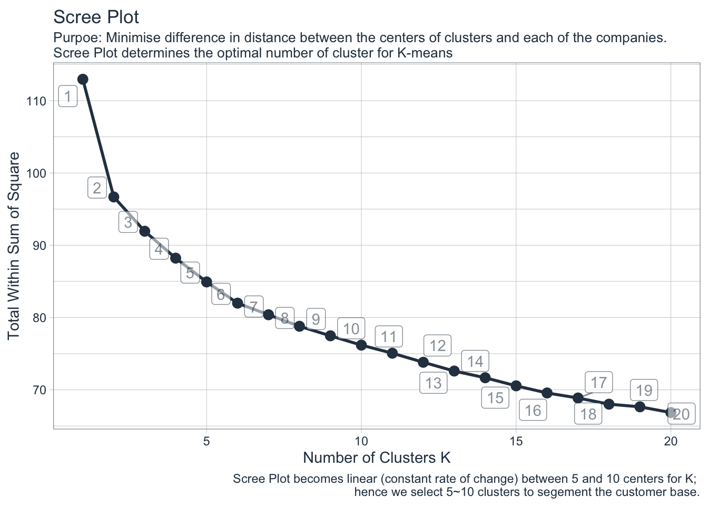
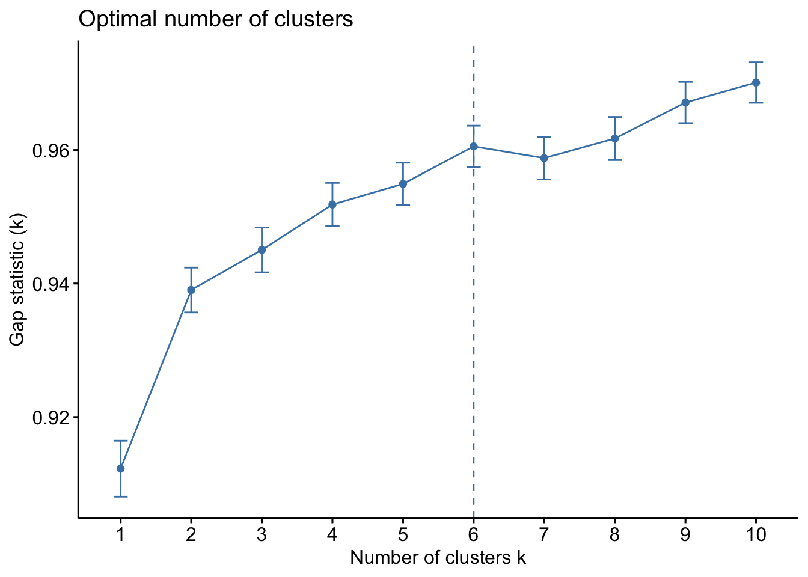

# Purpose: 

B2B sales organisation wants to know which companies are similar to each other to help in identifying potential customers in various segments of the market. There are many techniques for market research but in here we will try to penetrate various market segments using companies stock price data. 

When it comes to market research or investment, looking at the returns of dozens of companies will be a tricky analysis to draw various insights. The cluster analysis process of dividing a common set of companies into groups (by range and scope) provides a more holistic perspective on the internal and external relationship of the relevant companies. Since stocks have a tendency to fluctuate together, grouping by the similarity in return trend seems an applicable clustering recipe in practice. 

# Reference:

The code workflow here is been devloped from University of Business Science 101 course & UC Business analytics R programming guide. 


# Agenda: 

#### [1] Pull Stock Price Data from Yahoo Finance using getSymbols  

#### [2] Data Preparation: Preparing data for clustering (User-Item or User-date format) + Normalisation 

#### [3] Determine Optimal Clusters: Identify the optimal number of clusters from various statistical approaches 

#### [4] Visualisation aid by UMAP: 2-Dimensional feature reduction + plotly 


$$ 
return_{daily} = \frac{price_{i}-price_{i-1}}{price_{i-1}}
$$

# The Concept of Clustering 

The task of clustering analysis is to divide the set of objects into homogeneous groups. The ideal grouping is where the arbitrary objects belonging to the same group are more similar to each other than arbitrary objects belonging different groups. 

There are two questions we must find before applying cluster analysis$^1$:

* How to define the similarity between the object - the distance metric that we use to identify the common traits carries some kind of semantic meaning of similarity?

* In what manner should one make use of the thus defined similarity in the process of grouping - does clustering provide any new insight into the data? 

### Why Would One Undergo Cluster Analysis 

One may have collected large data set at different experimental sites and resources. Data may stem from subjects related to one and another, and there are further possibilities of hidden variables, e.g. macro external influence or special events,  which in a way could expand the variance and much uninterpretable noise in the data. If one is unaware of such a hierarchical relationship or is absent in this domain of knowledge, it is advised to apply a clustering method prior to further analysis. 

For an example of its interesting application, cluster analysis on both the customers and their typical and the atypical product items helps to uncover hidden needs of the customer database and verify the hypotheses concerning these common user-item relationships: play an important role in the development of the recommendation system. 


# Methods for measuring distances 

The choice of distance matrix is a critical step in cluster. It determines how the similarity of two elements (x, y) is calculated and it will directly influence the shape of the cluster. 

#### Euclidean Distance: 

* Most commonly used and often a default setting in many distance matrix algorithm in R

$$
d_{euc}(x, y) = \sqrt{\sum_{i=1}^n(x_i-y_i)^2}
$$

#### Manhattan Distance: 

$$
d_{man}(x, y) = \sum_{i=1}^n|(x_i-y_i)|
$$

#### Correlation-based distance: 

* Pearson correlation: Measures the degree of a linear relationship between two profiles. It is a paramteric correlation which depends on the distribution of the data. 

* Kendall & Spearman correlation correlation are non-parametric and they are used to perform rank-based correlation analysis. (Outlier sensitivity can be mitigated by using Spearman's correlation instead of Pearson's correlation)

* Considers two objects to be similar if their features are highly correlated, even though the observed values may be far apart in terms of Euclidean distance. 

* Correlation-based distance often preferred over two above matrix in case for dealing with high dimensional data set, due to curse of dimensionality. 

#### What type of distance measure should we choose?

Despite the choice of distance measure has a strong influence on the clustering result, it is often arbitrary. But we must note two things: 

[1] If we want to identify clusters of observations with the samll overall profiles regardless of their magnitudes, we shuld go with __correlation-based distance__ as a dissimilarity measure. In marketing, we can imagine a case where organisation like to identify group of shoppers with the same preference in terms of items, regardless of the volume of items they bought. 

[2] If Euclidean distance is chosen, then observations with high values of features will be clustered together. The same holds true for observations with low values of features. 


# K-means Aglorithm 

Kmeans algorithm is an iterative algorithm that tries to partition the dataset into pre-defined k distinct non-overlapping subgroups (clusters) where each data point belongs to only one group. It tries to make the intra-cluster data points as similar as possible while also keeping the clusters as different (far) as possible. It assigns data points to a cluster such that the sum of the squared distance between the data points and the cluster’s centroid (arithmetic mean of all the data points that belong to that cluster) is at the minimum. The less variation we have within clusters, the more homogeneous (similar) the data points are within the same cluster.

#### Basic Idea 

The way that kmeans algorithm operates are as follow: 

[1] Specify the number of clusters (K) to be created.

[2] Select random k objects from the data set as the initial cluster centers.

[3] Assigns each observation to their closest centroid, based on the Euclidean distance between the object and the centroid.

[4] For each of the k clusters __update the cluster centroid__ by calculating the new mean values of all the data points in the cluster. The centroid of a $\ K_{th}$ cluster is a vector of length p containing the means of all variables for the observations in the $\ K_{th}$ cluster; p is the number of variables.

[5] Iteratively minimize the total within sum of squares. That is, iterate steps 3 and 4 until the cluster assignments stop changing or the maximum number of iterations is reached. Hence, there is a tendency of retaining reliability of the accuracy with greater number of iteration. 


The approach kmeans follows to solve the problem is called Expectation-Maximization. The E-step is assigning the data points to the closest cluster. The M-step is computing the centroid of each cluster. Below is a break down of how we can solve it mathematically (feel free to skip it).


 
 
Sum of the squares deviation from the mean or the centroid. 

$$
\sum_{i=1}^n(x_i-\overline{x})^2 \\

\sum_{i=1}^n|(x_i-\overline{x})| \\


\frac{SS_B}{df_B}   \frac{SS_W}{df_W}
$$

$$
\frac{\partial f}{\partial x}
$$

```r
library(tidyverse)
library(tidyquant)
library(quantmod)
library(broom)
library(umap)
library(plotly)
library(factoextra)
library(cluster)
library(kableExtra)
```


```r
SP500_prices_tbl <- read_rds("/Users/seunghyunsung/Documents/GitHub/Modelbakery_backup/post3/sp500stock/sp_500_prices_tbl_2019.11_2021.11.rds")

SP500_index_tbl <- read_rds("/Users/seunghyunsung/Documents/GitHub/Modelbakery_backup/post3/sp500stock/SP500_index_list_tbl.rds")
```

```r
SP500_prices_tbl %>% head(20) %>% kbl() %>% kable_material()
```

<table class=" lightable-material" style='font-family: "Source Sans Pro", helvetica, sans-serif; margin-left: auto; margin-right: auto;'>
 <thead>
  <tr>
   <th style="text-align:left;"> symbol </th>
   <th style="text-align:left;"> date </th>
   <th style="text-align:right;"> open </th>
   <th style="text-align:right;"> high </th>
   <th style="text-align:right;"> low </th>
   <th style="text-align:right;"> close </th>
   <th style="text-align:right;"> volume </th>
   <th style="text-align:right;"> adjusted </th>
  </tr>
 </thead>
<tbody>
  <tr>
   <td style="text-align:left;"> A </td>
   <td style="text-align:left;"> 2019-11-21 </td>
   <td style="text-align:right;"> 78.97 </td>
   <td style="text-align:right;"> 78.97 </td>
   <td style="text-align:right;"> 77.31 </td>
   <td style="text-align:right;"> 78.30 </td>
   <td style="text-align:right;"> 2142200 </td>
   <td style="text-align:right;"> 77.19080 </td>
  </tr>
  <tr>
   <td style="text-align:left;"> A </td>
   <td style="text-align:left;"> 2019-11-22 </td>
   <td style="text-align:right;"> 78.61 </td>
   <td style="text-align:right;"> 79.19 </td>
   <td style="text-align:right;"> 78.23 </td>
   <td style="text-align:right;"> 79.12 </td>
   <td style="text-align:right;"> 1869700 </td>
   <td style="text-align:right;"> 77.99919 </td>
  </tr>
  <tr>
   <td style="text-align:left;"> A </td>
   <td style="text-align:left;"> 2019-11-25 </td>
   <td style="text-align:right;"> 79.45 </td>
   <td style="text-align:right;"> 80.46 </td>
   <td style="text-align:right;"> 79.30 </td>
   <td style="text-align:right;"> 80.26 </td>
   <td style="text-align:right;"> 2640800 </td>
   <td style="text-align:right;"> 79.12303 </td>
  </tr>
  <tr>
   <td style="text-align:left;"> A </td>
   <td style="text-align:left;"> 2019-11-26 </td>
   <td style="text-align:right;"> 78.57 </td>
   <td style="text-align:right;"> 81.03 </td>
   <td style="text-align:right;"> 77.96 </td>
   <td style="text-align:right;"> 80.95 </td>
   <td style="text-align:right;"> 5329900 </td>
   <td style="text-align:right;"> 79.80327 </td>
  </tr>
  <tr>
   <td style="text-align:left;"> A </td>
   <td style="text-align:left;"> 2019-11-27 </td>
   <td style="text-align:right;"> 81.08 </td>
   <td style="text-align:right;"> 81.34 </td>
   <td style="text-align:right;"> 80.69 </td>
   <td style="text-align:right;"> 81.08 </td>
   <td style="text-align:right;"> 1628000 </td>
   <td style="text-align:right;"> 79.93142 </td>
  </tr>
  <tr>
   <td style="text-align:left;"> A </td>
   <td style="text-align:left;"> 2019-11-29 </td>
   <td style="text-align:right;"> 80.96 </td>
   <td style="text-align:right;"> 81.24 </td>
   <td style="text-align:right;"> 80.47 </td>
   <td style="text-align:right;"> 80.77 </td>
   <td style="text-align:right;"> 835800 </td>
   <td style="text-align:right;"> 79.62580 </td>
  </tr>
  <tr>
   <td style="text-align:left;"> A </td>
   <td style="text-align:left;"> 2019-12-02 </td>
   <td style="text-align:right;"> 80.78 </td>
   <td style="text-align:right;"> 80.99 </td>
   <td style="text-align:right;"> 80.02 </td>
   <td style="text-align:right;"> 80.35 </td>
   <td style="text-align:right;"> 1775600 </td>
   <td style="text-align:right;"> 79.21176 </td>
  </tr>
  <tr>
   <td style="text-align:left;"> A </td>
   <td style="text-align:left;"> 2019-12-03 </td>
   <td style="text-align:right;"> 79.52 </td>
   <td style="text-align:right;"> 80.11 </td>
   <td style="text-align:right;"> 79.17 </td>
   <td style="text-align:right;"> 80.10 </td>
   <td style="text-align:right;"> 1978200 </td>
   <td style="text-align:right;"> 78.96529 </td>
  </tr>
  <tr>
   <td style="text-align:left;"> A </td>
   <td style="text-align:left;"> 2019-12-04 </td>
   <td style="text-align:right;"> 80.30 </td>
   <td style="text-align:right;"> 81.00 </td>
   <td style="text-align:right;"> 80.18 </td>
   <td style="text-align:right;"> 80.93 </td>
   <td style="text-align:right;"> 1690900 </td>
   <td style="text-align:right;"> 79.78355 </td>
  </tr>
  <tr>
   <td style="text-align:left;"> A </td>
   <td style="text-align:left;"> 2019-12-05 </td>
   <td style="text-align:right;"> 80.89 </td>
   <td style="text-align:right;"> 81.74 </td>
   <td style="text-align:right;"> 80.50 </td>
   <td style="text-align:right;"> 81.53 </td>
   <td style="text-align:right;"> 1900000 </td>
   <td style="text-align:right;"> 80.37504 </td>
  </tr>
  <tr>
   <td style="text-align:left;"> A </td>
   <td style="text-align:left;"> 2019-12-06 </td>
   <td style="text-align:right;"> 82.24 </td>
   <td style="text-align:right;"> 82.42 </td>
   <td style="text-align:right;"> 81.82 </td>
   <td style="text-align:right;"> 82.21 </td>
   <td style="text-align:right;"> 1783400 </td>
   <td style="text-align:right;"> 81.04540 </td>
  </tr>
  <tr>
   <td style="text-align:left;"> A </td>
   <td style="text-align:left;"> 2019-12-09 </td>
   <td style="text-align:right;"> 82.34 </td>
   <td style="text-align:right;"> 82.47 </td>
   <td style="text-align:right;"> 81.55 </td>
   <td style="text-align:right;"> 81.62 </td>
   <td style="text-align:right;"> 1913800 </td>
   <td style="text-align:right;"> 80.46377 </td>
  </tr>
  <tr>
   <td style="text-align:left;"> A </td>
   <td style="text-align:left;"> 2019-12-10 </td>
   <td style="text-align:right;"> 82.90 </td>
   <td style="text-align:right;"> 83.80 </td>
   <td style="text-align:right;"> 82.70 </td>
   <td style="text-align:right;"> 82.93 </td>
   <td style="text-align:right;"> 3067700 </td>
   <td style="text-align:right;"> 81.75521 </td>
  </tr>
  <tr>
   <td style="text-align:left;"> A </td>
   <td style="text-align:left;"> 2019-12-11 </td>
   <td style="text-align:right;"> 82.93 </td>
   <td style="text-align:right;"> 83.47 </td>
   <td style="text-align:right;"> 82.57 </td>
   <td style="text-align:right;"> 83.42 </td>
   <td style="text-align:right;"> 1718300 </td>
   <td style="text-align:right;"> 82.23827 </td>
  </tr>
  <tr>
   <td style="text-align:left;"> A </td>
   <td style="text-align:left;"> 2019-12-12 </td>
   <td style="text-align:right;"> 83.49 </td>
   <td style="text-align:right;"> 84.98 </td>
   <td style="text-align:right;"> 83.17 </td>
   <td style="text-align:right;"> 84.81 </td>
   <td style="text-align:right;"> 1920800 </td>
   <td style="text-align:right;"> 83.60857 </td>
  </tr>
  <tr>
   <td style="text-align:left;"> A </td>
   <td style="text-align:left;"> 2019-12-13 </td>
   <td style="text-align:right;"> 84.67 </td>
   <td style="text-align:right;"> 84.74 </td>
   <td style="text-align:right;"> 83.59 </td>
   <td style="text-align:right;"> 83.71 </td>
   <td style="text-align:right;"> 1811200 </td>
   <td style="text-align:right;"> 82.52417 </td>
  </tr>
  <tr>
   <td style="text-align:left;"> A </td>
   <td style="text-align:left;"> 2019-12-16 </td>
   <td style="text-align:right;"> 84.47 </td>
   <td style="text-align:right;"> 84.97 </td>
   <td style="text-align:right;"> 84.00 </td>
   <td style="text-align:right;"> 84.45 </td>
   <td style="text-align:right;"> 1371200 </td>
   <td style="text-align:right;"> 83.25369 </td>
  </tr>
  <tr>
   <td style="text-align:left;"> A </td>
   <td style="text-align:left;"> 2019-12-17 </td>
   <td style="text-align:right;"> 84.76 </td>
   <td style="text-align:right;"> 84.86 </td>
   <td style="text-align:right;"> 83.78 </td>
   <td style="text-align:right;"> 83.95 </td>
   <td style="text-align:right;"> 1653200 </td>
   <td style="text-align:right;"> 82.76075 </td>
  </tr>
  <tr>
   <td style="text-align:left;"> A </td>
   <td style="text-align:left;"> 2019-12-18 </td>
   <td style="text-align:right;"> 83.75 </td>
   <td style="text-align:right;"> 84.05 </td>
   <td style="text-align:right;"> 83.36 </td>
   <td style="text-align:right;"> 83.43 </td>
   <td style="text-align:right;"> 2025500 </td>
   <td style="text-align:right;"> 82.24812 </td>
  </tr>
  <tr>
   <td style="text-align:left;"> A </td>
   <td style="text-align:left;"> 2019-12-19 </td>
   <td style="text-align:right;"> 83.95 </td>
   <td style="text-align:right;"> 84.67 </td>
   <td style="text-align:right;"> 83.56 </td>
   <td style="text-align:right;"> 84.51 </td>
   <td style="text-align:right;"> 1696000 </td>
   <td style="text-align:right;"> 83.31284 </td>
  </tr>
</tbody>
</table>


```r
SP500_index_tbl %>% head(20) %>% kbl() %>% kable_material()
```

<table class=" lightable-material" style='font-family: "Source Sans Pro", helvetica, sans-serif; margin-left: auto; margin-right: auto;'>
 <thead>
  <tr>
   <th style="text-align:left;"> symbol </th>
   <th style="text-align:left;"> company </th>
   <th style="text-align:left;"> sector </th>
  </tr>
 </thead>
<tbody>
  <tr>
   <td style="text-align:left;"> A </td>
   <td style="text-align:left;"> Agilent Technologies Inc. </td>
   <td style="text-align:left;"> Health Care </td>
  </tr>
  <tr>
   <td style="text-align:left;"> AAL </td>
   <td style="text-align:left;"> American Airlines Group Inc. </td>
   <td style="text-align:left;"> Industrials </td>
  </tr>
  <tr>
   <td style="text-align:left;"> AAP </td>
   <td style="text-align:left;"> Advance Auto Parts Inc. </td>
   <td style="text-align:left;"> Consumer Discretionary </td>
  </tr>
  <tr>
   <td style="text-align:left;"> AAPL </td>
   <td style="text-align:left;"> Apple Inc. </td>
   <td style="text-align:left;"> Information Technology </td>
  </tr>
  <tr>
   <td style="text-align:left;"> ABBV </td>
   <td style="text-align:left;"> AbbVie Inc. </td>
   <td style="text-align:left;"> Health Care </td>
  </tr>
  <tr>
   <td style="text-align:left;"> ABC </td>
   <td style="text-align:left;"> AmerisourceBergen Corporation </td>
   <td style="text-align:left;"> Health Care </td>
  </tr>
  <tr>
   <td style="text-align:left;"> ABMD </td>
   <td style="text-align:left;"> ABIOMED Inc. </td>
   <td style="text-align:left;"> Health Care </td>
  </tr>
  <tr>
   <td style="text-align:left;"> ABT </td>
   <td style="text-align:left;"> Abbott Laboratories </td>
   <td style="text-align:left;"> Health Care </td>
  </tr>
  <tr>
   <td style="text-align:left;"> ACN </td>
   <td style="text-align:left;"> Accenture Plc Class A </td>
   <td style="text-align:left;"> Information Technology </td>
  </tr>
  <tr>
   <td style="text-align:left;"> ADBE </td>
   <td style="text-align:left;"> Adobe Inc. </td>
   <td style="text-align:left;"> Information Technology </td>
  </tr>
  <tr>
   <td style="text-align:left;"> ADI </td>
   <td style="text-align:left;"> Analog Devices Inc. </td>
   <td style="text-align:left;"> Information Technology </td>
  </tr>
  <tr>
   <td style="text-align:left;"> ADM </td>
   <td style="text-align:left;"> Archer-Daniels-Midland Company </td>
   <td style="text-align:left;"> Consumer Staples </td>
  </tr>
  <tr>
   <td style="text-align:left;"> ADP </td>
   <td style="text-align:left;"> Automatic Data Processing Inc. </td>
   <td style="text-align:left;"> Information Technology </td>
  </tr>
  <tr>
   <td style="text-align:left;"> ADSK </td>
   <td style="text-align:left;"> Autodesk Inc. </td>
   <td style="text-align:left;"> Information Technology </td>
  </tr>
  <tr>
   <td style="text-align:left;"> AEE </td>
   <td style="text-align:left;"> Ameren Corporation </td>
   <td style="text-align:left;"> Utilities </td>
  </tr>
  <tr>
   <td style="text-align:left;"> AEP </td>
   <td style="text-align:left;"> American Electric Power Company Inc. </td>
   <td style="text-align:left;"> Utilities </td>
  </tr>
  <tr>
   <td style="text-align:left;"> AES </td>
   <td style="text-align:left;"> AES Corporation </td>
   <td style="text-align:left;"> Utilities </td>
  </tr>
  <tr>
   <td style="text-align:left;"> AFL </td>
   <td style="text-align:left;"> Aflac Incorporated </td>
   <td style="text-align:left;"> Financials </td>
  </tr>
  <tr>
   <td style="text-align:left;"> AIG </td>
   <td style="text-align:left;"> American International Group Inc. </td>
   <td style="text-align:left;"> Financials </td>
  </tr>
  <tr>
   <td style="text-align:left;"> AIZ </td>
   <td style="text-align:left;"> Assurant Inc. </td>
   <td style="text-align:left;"> Financials </td>
  </tr>
</tbody>
</table>


```r
SP500_daily_returns_tbl <- SP500_prices_tbl %>% 
    select(symbol, date, adjusted) %>% 
    group_by(symbol) %>% 
    mutate(lag = lag(adjusted, order_by = date, n = 1)) %>% 
    filter(!is.na(lag)) %>% 
    mutate(diff = adjusted - lag) %>% 
    mutate(pct_return = diff/lag)  %>% ungroup() %>% 
    select(symbol, date, pct_return) 
```


## Convert to User-Item Format: here it would be Company-Return Format


```r
SP500_date_matrix_tbl <- SP500_daily_returns_tbl %>% 
  spread(date, pct_return, fill = 0)
```


```r
distance <- get_dist(SP500_date_matrix_tbl %>% select(-symbol))
fviz_dist(distance, gradient = list(low = "#00AFBB", mid = "white", high = "#FC4E07"))
```


```r
set.seed(42)
kmeans_obj <- SP500_date_matrix_tbl %>% 
    select(-symbol) %>% 
    kmeans(centers =7, nstart = 30)

kmeans_obj %>% broom::glance()
```

```
## # A tibble: 1 × 4
##   totss tot.withinss betweenss  iter
##   <dbl>        <dbl>     <dbl> <int>
## 1  113.         80.4      32.6     5
```


## Step 4 - Find the optimal value of K


#### Direct Methods: Consists of optimizing a criterion, such as the within  cluster sums of squares or the avergae silhouette.


#### Elbow Method

There are several k-means algorithms available. The basic idea behind the Elbow method aims to to minimize the Euclidean distances of all points with their nearest cluster centers, by minimizing total intra-cluster variation (within-cluster sum of squares, WSS).

$$
Total\ Variation = Variation\ Within + Variation\ Between \\
$$
$$
TSS = WSS + BSS\      where\  SS\ = Sum\ of\ Squares  
$$


```r
set.seed(42)
kmeans_mapper <- function(center = 3) {
    SP500_date_matrix_tbl %>%
        select(-symbol) %>%
        kmeans(centers = center, nstart = 20)
}

cluster_tbl <- tibble(centers = 1:20)

k_means_mapped_tbl <- cluster_tbl %>% 
  mutate(k_means = centers %>% map(kmeans_mapper),
         glance  = k_means %>% map(glance))
```

The Elbow method looks at the total within sum of squares as a function of the number of clusters. With ever increasing the number of clusters (max at number of observations) the WSS will continuously descend in a linear manner. One should choose a number of clusters one before constant rate of WSS change is reached, that is adding another cluster does not significantly influence total WSS. 

To note, the elbow method is sometimes ambiguous. In our SP500 return data set, it is difficult to spot optimal cluster k, with our naked eye. Hence, I got the pulse of local region 5~10 to investigate further using alternative clustering approach. 


```r
k_means_mapped_tbl %>% 
  unnest(glance) %>% 
  ggplot(aes(x = centers, y = tot.withinss)) +
  geom_point(colour = palette_light()[1], size = 3) +
  geom_line(colour = palette_light()[1], size = 1) +
  ggrepel::geom_label_repel(aes(label = centers, alpha = 0.7), colour = palette_light()[1]) +
  theme_tq() +
  labs(
        x = "Number of Clusters K",
        y = "Total Within Sum of Square",
        title = "Scree Plot",
        subtitle = "Purpoe: Minimise difference in distance between the centers of clusters and each of the companies.
Scree Plot determines the optimal number of cluster for K-means",
        caption = "Scree Plot becomes linear (constant rate of change) between 5 and 10 centers for K; 
        hence we select 5~10 clusters to segement the customer base."
    ) +
  theme(legend.position = "none")
```



#### Average Silhouette Method

* Measures the quality of a clustering. It determines how well each object lies within its cluster. A high average silhouette width indicates a good clustering. 


```r
# function to compute average silhouette for k clusters
silhouette_mapper <- function(k) {
    df <- SP500_date_matrix_tbl %>% select(-symbol)
    
    k_means <- df %>%
        kmeans(centers = k, nstart = 20)
    
    ss <- silhouette(k_means$cluster, dist(df))
    if(k == 1){
      return(NA) 
    } else{
    mean(ss[, 3])
    }
}

k_means_silhouette_mapped_tbl <- cluster_tbl %>% 
  mutate(k_means = centers %>% map(silhouette_mapper)) %>% unnest(k_means)
```

#### [2] Silhouette Method: Visualisation


```r
k_means_silhouette_mapped_tbl[-1,] %>% 
  ggplot(aes(centers, k_means)) +
  geom_point(colour = palette_light()[1], size = 3) +
  geom_line(colour = palette_light()[1], size = 1) +
  ggrepel::geom_label_repel(aes(label = centers, alpha = 0.7), colour = palette_light()[1]) +
  theme_tq() +
  labs(
        x = "Number of Clusters K",
        y = "Average Silhouette Width",
        title = "Scree Plot",
        subtitle = "Purpoe: Minimise difference in distance between the centers of clusters and each of the companies.
Scree Plot determines the optimal number of cluster for K-means",
        caption = "Scree Plot becomes linear (constant rate of change) between 5 and 10 centers for K; 
        hence we select 5~10 clusters to segement the customer base."
    ) +
  theme(legend.position = "none")
```


#### Statistical Testing Methods: consists of comparing evidence against null hypothesis. An example is the gap analysis. 

#### Gap Statistic Method

The gap analysis compares the total within intra-cluster variation for different values of k with their expected values under null reference distribution of the data. The estimate of the optimal clusters will be value that maximise the gap statistics. This means that the clustering strucutre is far away from the random uniform distribution of points. 


```r
set.seed(42)
gap_stat <- clusGap(SP500_date_matrix_tbl %>% select(-symbol),
                    FUN = kmeans,
                    nstart = 25,
                    K.max = 10,
                    B = 50)
```

```
## Warning: did not converge in 10 iterations
```

```r
fviz_gap_stat(gap_stat)
```


#### Conclusion:

* In order to retain the hierachical relationship with industry sector 


## Visualising k-means clusters 

#### Use UMAP for 2-D Projection 

Once K-Means Clustering is performed, we can use UMPA (or PCA) to help us visualise each data point according to its cluster assignment. The problem that these observations (companies) are high dimension in space can be solved by applying a dimensionality reduction algorithm to output two most influencial variables respect to the originial variables. 


```r
umap_obj <- SP500_date_matrix_tbl %>% 
    select(-symbol) %>% 
    umap()

umap_result_tbl <- umap_obj$layout %>% 
    as_tibble() %>% 
    setNames(c("x", "y")) %>% 
    bind_cols(SP500_date_matrix_tbl %>% select(symbol))
```


```r
# Get the k_means_obj from the 6th center
k_means_obj <- k_means_mapped_tbl %>% 
    filter(centers == 6) %>% 
    pull(k_means) %>%  pluck(1) 

umap_kmeans_SP500_result_tbl <- k_means_obj %>% 
    broom::augment(SP500_date_matrix_tbl %>% select(symbol)) %>%
    left_join(umap_result_tbl, by = "symbol") %>% 
    left_join(SP500_index_tbl %>% select(symbol, company, sector), by = "symbol")
```


